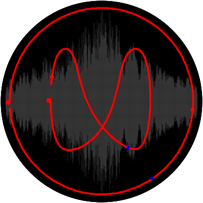

==================================
Granular sound synthesis interface
==================================

SoundGrain is a graphical interface where users can draw 
and edit trajectories to control granular sound synthesis 
modules. 

Official web site
-----------------

To download the latest stable version of Soundgrain, go to 
`the official web site! <http://ajaxsoundstudio.com/software/soundgrain/>`_

Requirements
------------

**Minimum versions (for running Soundgrain from sources):**

* `Python 3.5 <https://www.python.org/downloads/release/python-354/>`_ or
  `Python 3.6 <https://www.python.org/downloads/release/python-364/>`_ (prefered).
The programming language used to code the application.

* `WxPython 4.0.1 (Phoenix) <https://wxpython.org/pages/downloads/>`_
The toolkit used to create the graphical interface. (install with `pip install wxPython`)

* `pyo 0.9.0 <http://ajaxsoundstudio.com/software/pyo/>`_
The audio engine which gives his power to Soundgrain.

* `python-markdown 2.6.11 <https://pypi.python.org/pypi/Markdown>`_
The markdown package used to format the builtin documentation.

