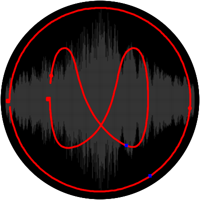

==================================
Granular sound synthesis interface
==================================

SoundGrain is a graphical interface where users can draw 
and edit trajectories to control granular sound synthesis 
modules. 

Official web site
-----------------

For source code and releases, visit
`SoundGrain on GitHub <https://github.com/belangeo/soundgrain>`_.

Requirements
------------

**Dependencies for running SoundGrain from source:**

* `Python <https://www.python.org/downloads/>`_

  The programming language used to code the application.

* `wxPython <https://wxpython.org/pages/downloads/>`_

  The toolkit used to create the graphical interface. Install with ``pip install wxPython``.

* `pyo <https://github.com/belangeo/pyo>`_

  The audio engine that powers SoundGrain.

* `Markdown <https://pypi.org/project/Markdown/>`_

  The Markdown package used to format the built-in documentation.

